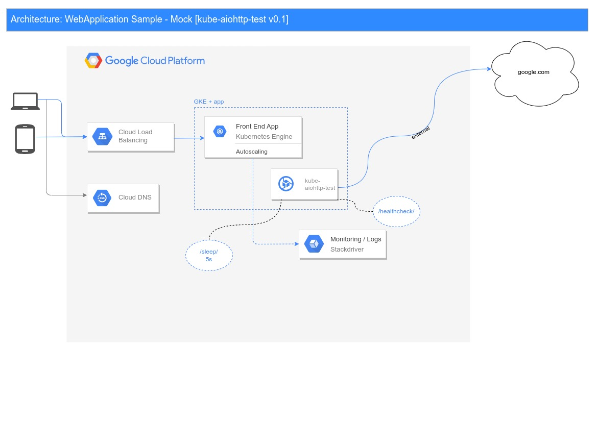

# Kube Aiohttp Test

Context
-------

aiohttp for performance test using the following scenarios:
-sleep thread
-get external api

## Architecture Diagram



Install
-------

Make sure you have Python >=3.7, create a [virtualenv](https://virtualenv.pypa.io/en/latest/)
and execute:

```
make requirements-dev
```

Run
---

Execute:

```
make run
```


Unit Tests
----------

Execute:

```
make test
```

Coverage
----------

Execute:

```
make test-coverage
```


Release
-------
Before generating a release you must create a env-var like the following:

```
export SIMPLE_SETTINGS=kube_aiohttp_test.settings.development 
```

This project uses [Semantic Versioning](http://semver.org/)
To make a release use one of the following commads:

```
make release-patch
make release-minor
make release-major
```

After running the command, you can simply push the tags to github with the command `git push && git push --tags`
